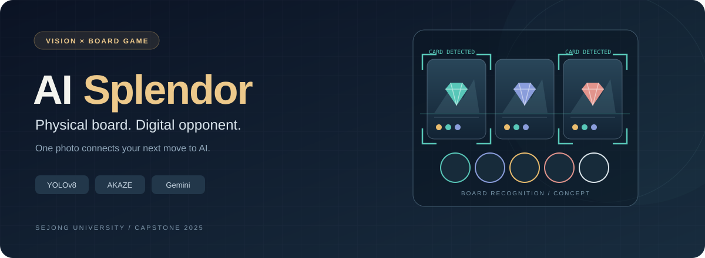
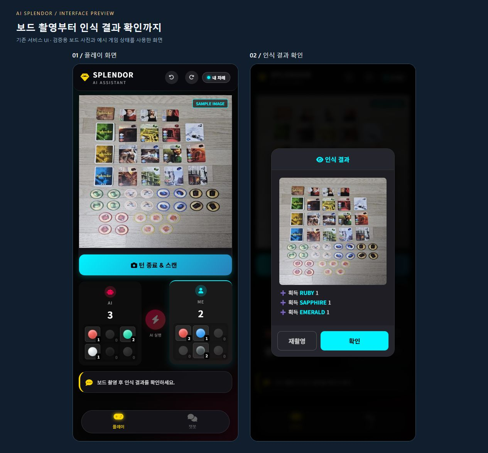
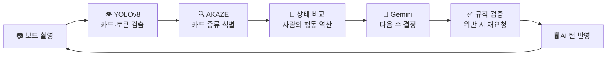
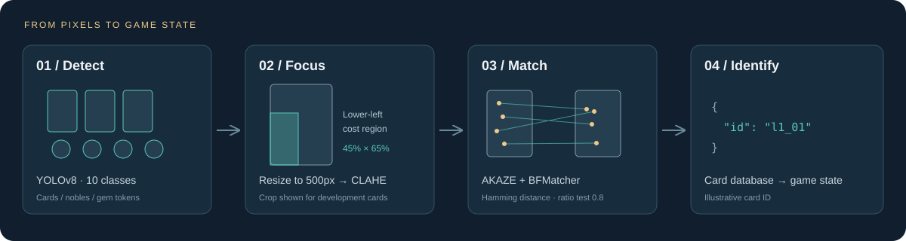
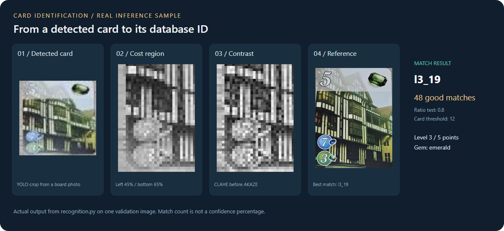
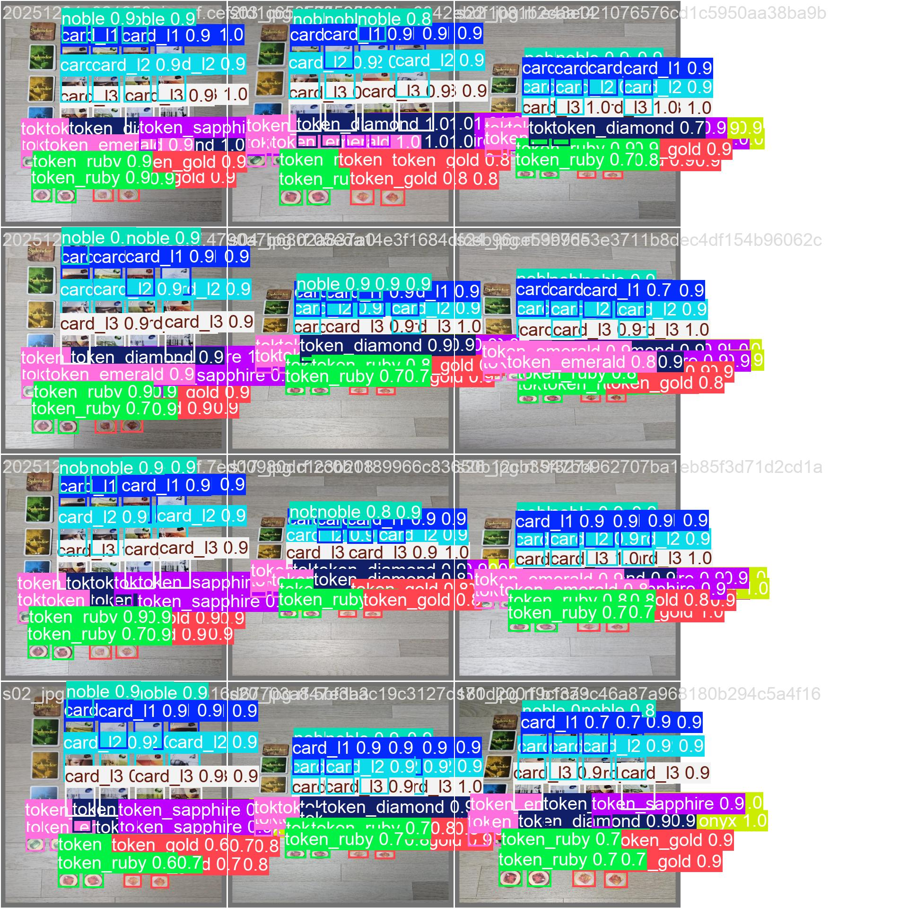
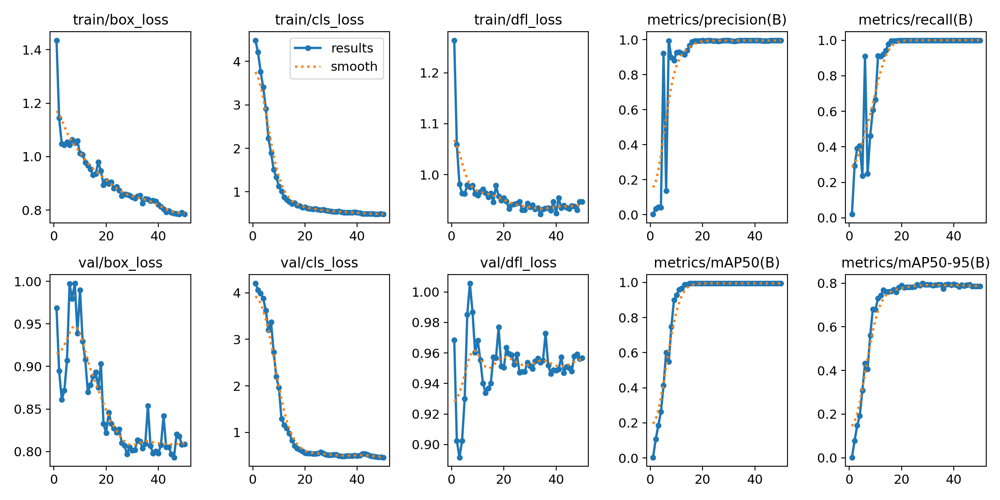
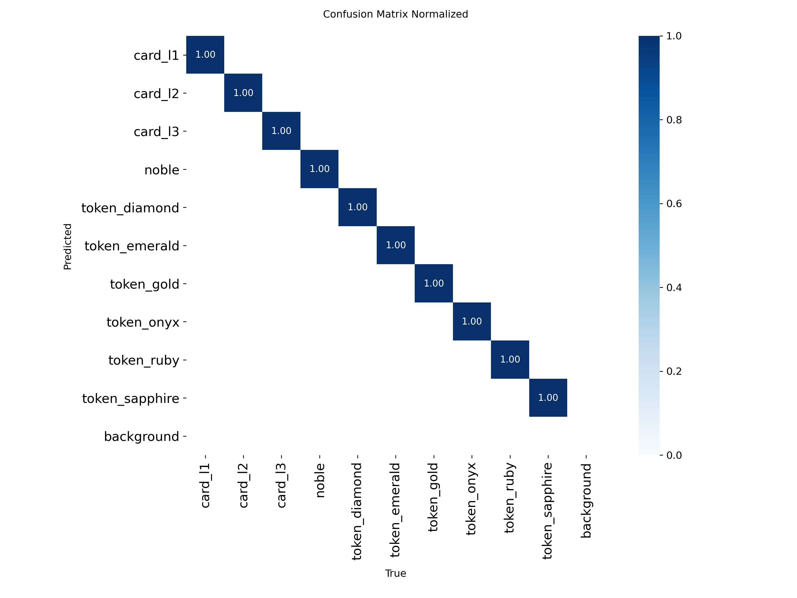
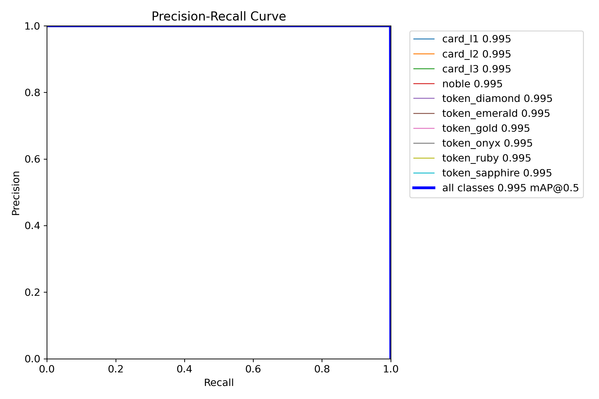

<div align="center">



# AI Splendor

**실제 보드판을 사진 한 장으로 읽어, AI가 사람의 상대가 되어 플레이하는 보드게임 어시스턴트**


세종대학교 지능기전공학부 캡스톤 프로젝트 · 2025

**3인 팀 프로젝트 · 컴퓨터 비전(CV) 파트 담당**

[시연 영상](#demo) · [핵심 설계](#vision) · [담당 역할](#contribution) · [인식 성능](#results) · [실행 방법](#setup)

</div>

---

| 플레이 방식 | 담당 영역 | 인식 구조 |
|:---:|:---:|:---:|
| 실물 보드 촬영 → AI와 턴 진행 | 데이터 구축 · 검출 · 카드 식별 | YOLOv8 검출 + AKAZE 매칭 |

<a id="contribution"></a>

## 담당 역할과 성과

**3인 팀에서 컴퓨터 비전 파트를 담당했습니다.** 보드 촬영 데이터를 구성하고, 객체 검출부터 개별 카드 식별까지의 인식 흐름을 구현했습니다.

| 담당 | 수행한 작업 | 결과 · 관련 코드 |
|---|---|---|
| 데이터 구축 | 보드 촬영 · Roboflow 라벨링 · 10개 클래스 데이터셋 구성 | 카드 3단계 · 귀족 · 보석 토큰 6종 |
| 객체 검출 | YOLOv8 학습·튜닝 및 성능 평가 | 검증 mAP@50 **0.995** · [train.py](train.py) |
| 카드 식별 | OCR → ORB → AKAZE로 접근 전환 | 검출 위치와 카드 ID 식별을 분리 |
| 인식 구현 | 비용 영역 추출 · 대비 보정 · 특징점 매칭 | [recognition.py](recognition.py) |

아래에서는 **담당한 CV 설계와 검증 결과**를 중심으로 설명하고, 게임 엔진·AI 연동은 전체 시스템의 동작 맥락으로 소개합니다.

---

<a id="demo"></a>

## 🎥 시연 영상

[](https://youtu.be/FWvdVKT1ijA)

> 사람이 물리적 보드에서 자기 턴을 두고 사진을 찍으면, AI가 화면에서 자기 턴을 두는 전체 흐름입니다.
> **[▶ YouTube에서 전체 시연 보기](https://youtu.be/FWvdVKT1ijA)**

### 서비스 화면



보드 촬영 화면에서 **점수·보석 현황**을 확인하고, 스캔 후에는 인식된 변화를 검토해 **확인 또는 재촬영**을 선택합니다.

> 기존 서비스 UI에 검증용 보드 사진과 예시 게임 상태를 넣어 캡처했습니다. 실시간 촬영이나 실제 경기 기록은 아니며, 전체 플레이 흐름은 위 시연 영상에서 확인할 수 있습니다.

---

## 어떤 문제를 풀었나

보드게임 '스플렌더'를 혼자 연습하거나 AI와 겨루려면, 보통은 게임 전체를 디지털로 옮겨야 합니다. 그러면 **실물 보드게임을 하는 경험이 사라집니다.**

이 프로젝트는 반대로 접근했습니다. 사람은 실제 카드와 보석 토큰을 만지며 평소처럼 게임을 하고, **자기 턴이 끝나면 보드를 한 번 찍기만 합니다.** 나머지는 전부 자동으로 처리됩니다.



사람은 **물리적 보드**로, AI는 **화면**으로 같은 한 판을 둡니다.

---

<a id="vision"></a>

## 핵심 설계 — 검출과 식별의 분리



이 프로젝트에서 가장 오래 붙잡았던 문제입니다.

현재 YOLO 모델은 *"여기에 레벨2 카드가 있다"* 까지 검출하지만, **개별 카드의 ID는 분류하지 않습니다.** 카드마다 비용과 점수가 다르기 때문에 게임 로직에는 이 정보가 반드시 필요합니다.

개발 카드 90종을 각각 별도 클래스로 학습하는 방법도 있지만, 카드별 학습 데이터를 확보해야 하고 새 종류가 추가되면 재학습이 필요합니다. 그래서 **검출과 식별을 분리**했습니다.

| 단계 | 방법 | 역할 | 재학습 필요? |
|---|---|---|---|
| 1차 | YOLOv8 (검출) | 카드·토큰이 **어디에** 있는지 | 필요 |
| 2차 | AKAZE + BFMatcher (매칭) | 그 카드가 **무엇인지** | 같은 검출 클래스 내에서는 참조 이미지·카드 DB 추가 |

같은 검출 클래스에 카드를 추가할 때는 참조 이미지와 카드 DB를 확장할 수 있습니다. 현재 매칭 코드는 카드 이미지를 너비 500px로 맞추고, **좌측 하단 비용 영역(너비 45% · 높이 65%)**을 잘라 CLAHE로 대비를 보정한 뒤 AKAZE 특징점을 비교합니다. 귀족 타일은 전체 이미지를 사용합니다.

### 실제 카드 식별 사례



검증용 보드 사진에 현재 `recognition.py`의 검출·매칭 코드를 실행한 사례입니다. 작게 촬영된 카드에서 비용 영역을 추출하고 대비를 보정한 뒤, 참조 이미지와 비교해 **`l3_19`(3단계 · 5점 · 에메랄드 보너스)**로 식별했습니다.

> **48개**는 ratio test를 통과한 특징점 매칭 수이며 확률이나 정확도 백분율이 아닙니다. 단일 식별 사례로, 전체 카드 ID 정확도를 뜻하지 않습니다. [이미지 출처와 생성 조건](docs/image-sources.md)

---

## 카드 식별 — 세 번의 시도

2차 단계(카드가 무엇인지 알아내기)는 처음부터 특징점 매칭이었던 게 아닙니다. **두 번 갈아엎고 세 번째에 정착했습니다.**

### ① OCR — 폐기

카드에 인쇄된 비용과 점수를 **글자로 읽어서** 식별하려 했습니다. 두 가지 벽에 부딪혔습니다.

- **글자가 너무 작았습니다.** 보드 전체를 한 장에 담아야 하는데, 그러면 카드 한 장이 작게 나오고 그 안의 숫자는 더 작아집니다. OCR이 인식할 수 있는 해상도에 미치지 못했습니다.
- **조명과 각도에 지나치게 민감했습니다.** 같은 카드를 조금만 기울여 찍어도 결과가 달라졌습니다.

카드를 한 장씩 크게 찍게 만들면 해결되지만, 그건 *"턴 끝나고 보드를 한 번 찍는다"* 는 이 프로젝트의 전제를 깨는 일이었습니다. 그래서 **텍스트 기반 접근 자체를 버렸습니다.**

### ② ORB — 방향은 맞았으나 부족

글자 대신 **이미지 자체를 대조**하는 특징점 매칭으로 방향을 틀었습니다. ORB는 빠르고 라이선스 제약이 없어 첫 선택지였습니다.

방향은 맞았지만 정확도가 모자랐습니다.

- 비슷한 색감·구도의 카드끼리 **오매칭**이 발생했습니다
- 카드가 기울어지거나 촬영 거리가 바뀌면 **특징점이 무너졌습니다**

### ③ AKAZE — 채택

촬영 조건에서의 **매칭 안정성과 턴당 처리 부담**을 고려해 AKAZE로 옮겼습니다. 현재 구현은 비용 영역 추출과 대비 보정을 함께 적용해 특징점을 비교합니다.

| 방법 | 성격 | 결과 |
|---|---|---|
| OCR | 텍스트 인식 | ❌ 해상도·조명 한계로 폐기 |
| ORB | 이진 특징점 매칭 | ⚠️ 프로젝트 촬영 조건에서 오매칭 발생 |
| SIFT | 특징점 매칭 대안 | ➖ 턴당 응답 시간 부담을 고려해 제외 |
| **AKAZE** | **비용 영역 전처리와 특징점 매칭** | **✅ 현재 구현에 채택** |

이 비교는 프로젝트의 접근 선택 과정이며, 동일 조건에서 측정한 알고리즘별 정확도·처리 시간 벤치마크는 아닙니다.

> 세 번의 시도가 모두 같은 질문에 대한 답이었습니다 — **"보드 전체를 찍은 한 장의 사진에서, 작게 찍힌 카드를 어떻게 특정할 것인가."**
> 제약(한 장으로 전부, 턴마다 빠르게)을 바꾸지 않고 방법을 바꾸는 쪽을 택했습니다.

---

<a id="results"></a>

## 인식 성능

`YOLOv8n` · 50 epochs · 640px · batch 16 · CPU 학습 (약 33분)

| 지표 | 값 |
|---|---|
| **mAP@50** | **0.995** |
| **mAP@50-95** | **0.785** |
| Precision | 0.995 |
| Recall | 1.000 |

> [학습 기록](docs/results.csv)의 마지막 epoch 기준으로 반올림한 **객체 검출 지표**입니다. AKAZE 카드 ID 식별이나 전체 게임 진행의 정확도를 뜻하지 않습니다.

### 검증 세트 예측 결과



촬영한 보드 이미지에 대한 검증 배치 예측입니다. 카드 3단계·귀족 타일·보석 토큰 6종의 검출 결과를 확인할 수 있습니다. 이미지를 클릭하면 원본 크기로 볼 수 있습니다.

<details>
<summary><strong>학습 곡선 · 혼동 행렬 · PR 곡선 펼쳐보기</strong></summary>


<table>
<tr>
<td width="50%"><br/><sub>학습 곡선</sub></td>
<td width="50%"><br/><sub>혼동 행렬 (정규화)</sub></td>
</tr>
</table>



</details>

> **수치에 대한 솔직한 해석**
>
> Recall 1.000은 **해당 검증 세트에서의 결과**입니다. 촬영 환경(같은 바닥, 비슷한 조명·각도)이 제한적이므로 다른 환경에서도 같은 성능을 보장하지는 않습니다.
> mAP@50-95는 더 엄격한 위치 일치 기준까지 포함한 지표입니다. mAP@50과의 차이만으로 원인을 단정할 수는 없으며, 바운딩 박스의 위치 정밀도를 추가로 점검할 필요가 있습니다.
> 실사용 수준으로 끌어올리려면 조명·배경·각도를 다양화한 데이터가 더 필요합니다.

---

## 기술 스택

| 영역 | 기술 |
|---|---|
| 객체 검출 | YOLOv8 (Ultralytics) |
| 특징점 매칭 | OpenCV AKAZE · BFMatcher (Hamming) |
| LLM | Google Gemini 2.5 Flash |
| 백엔드 | Flask |
| 프론트엔드 | Vanilla JS |
| 데이터 라벨링 | Roboflow |

---

## 설계상 신경 쓴 부분

### AI가 규칙을 어기면 다시 시킨다

LLM은 종종 불가능한 수를 둡니다 — 없는 보석을 가져가거나, 살 수 없는 카드를 사려 합니다.

`app.py`의 AI 턴 처리는 **게임 엔진이 먼저 행동을 검증**하고, 거부되면 그 사유를 피드백으로 붙여 다시 요청합니다. **최초 요청을 포함해 최대 3회 시도**하며, LLM 출력을 게임 규칙으로 검증하는 구조입니다.

```python
for i in range(max_retries):
    ai_action = ai_brain.get_ai_action(current_state, feedback=feedback_msg)
    success, msg = game_engine.apply_action('ai', ai_action)
    if success:
        return ...
    feedback_msg = msg      # 실패 사유를 다음 프롬프트에 전달
```

### 인식 오류가 게임 상태를 오염시키지 않게 한다

사진 인식 오류에 대비해 두 가지 안전장치를 뒀습니다.

- 인식된 카드와 보석이 **모두 없으면** 상태를 갱신하지 않고 재촬영을 요청합니다
- 특정 보석 또는 보석의 총 감소량이 한 턴에 **3개를 넘으면** 스캔 결과를 반영하지 않고 재촬영을 요청합니다

그래도 잘못 반영되면 `/undo`로 직전 턴을 복구할 수 있습니다.

### 확정 전에 사람에게 보여준다

스캔 결과는 바로 반영되지 않습니다. 무엇이 바뀐 것으로 인식했는지 사용자에게 먼저 보여주고, **확인을 누른 뒤에야** 게임 상태에 적용됩니다.

---

<a id="setup"></a>

## 실행 방법

```bash
git clone https://github.com/jjuny0326/ai-splendor-boardgame.git
cd ai-splendor-boardgame

pip install -r requirements.txt

# 키 설정
cp .env.example .env        # Windows: copy .env.example .env
# .env 를 열어 GEMINI_API_KEY 를 채웁니다

python check_setup.py       # 모델·참조이미지·DB 점검
python app.py
```

## 데이터셋

Roboflow Universe에 공개되어 있습니다. (CC BY 4.0)

> [Roboflow Universe에서 데이터셋 보기](https://universe.roboflow.com/aiboardgame/aiboardgame-nko9n)

**10개 클래스**

`card_l1` `card_l2` `card_l3` `noble` `token_diamond` `token_emerald` `token_gold` `token_onyx` `token_ruby` `token_sapphire`

재학습하려면 `.env`에 `ROBOFLOW_API_KEY`를 추가하고:

```bash
python train.py
```

---

## 프로젝트 구조

```text
.
├── app.py                  Flask 라우팅 (스캔 / 턴 확정 / AI 턴 / 채팅 / 되돌리기)
├── recognition.py          YOLO 검출 + AKAZE 카드 식별
├── game_logic.py           스플렌더 규칙, 상태 추론, 행동 검증
├── llm_brain.py            Gemini 프롬프트 구성 및 응답 파싱
├── database.py             카드 데이터 로더
├── check_setup.py          실행 전 환경 점검
├── card_database.json      개발 카드 90종 + 귀족 타일 10종
├── train.py                YOLOv8 재학습
├── models/
│   └── board_scanner.pt    학습된 검출 모델
├── templates/index.html
├── static/                 script.js · style.css
└── docs/                   소개 배너 · 인식 과정 그림 · 학습 결과
```

### 주요 API

| 메서드 | 경로 | 설명 |
|---|---|---|
| `POST` | `/scan` | 보드 사진 업로드 → 인식 → 변화 추론 (아직 확정 아님) |
| `POST` | `/confirm_human` | 인식 결과를 게임 상태에 확정 반영 |
| `POST` | `/ai_turn` | AI 턴 실행 (최초 요청 포함 최대 3회 시도) |
| `POST` | `/undo` | 직전 턴 되돌리기 |
| `POST` | `/chat` | 현재 판을 근거로 규칙·전략 질문에 답변 |
| `GET` | `/game_state` | 현재 게임 상태 조회 |

---

## 한계와 개선 방향

- **촬영 환경 의존성** — 조명·각도·배경이 바뀌면 인식률이 떨어집니다. 데이터 증강과 다양한 환경에서의 추가 촬영이 필요합니다.
- **상태 휘발** — 게임 상태(`game_engine.game_state`)와 확정 전 스캔 결과(`PENDING_DATA`)가 프로세스 메모리에 있어 서버를 재시작하면 사라집니다. 세션 저장소나 DB로 옮겨야 합니다.
- **매칭 성능** — 검출된 레벨에 해당하는 참조 이미지들을 순회하며 매칭하므로, 후보 카드가 늘어나면 비교 비용도 증가합니다. 특징점 인덱싱 등으로 개선할 여지가 있습니다.
- **2인 플레이 전용** — 3~4인 규칙은 구현되어 있지 않습니다.

---

<div align="center">
<sub>세종대학교 지능기전공학부 스마트기기전공 · 캡스톤 프로젝트</sub>
</div>
